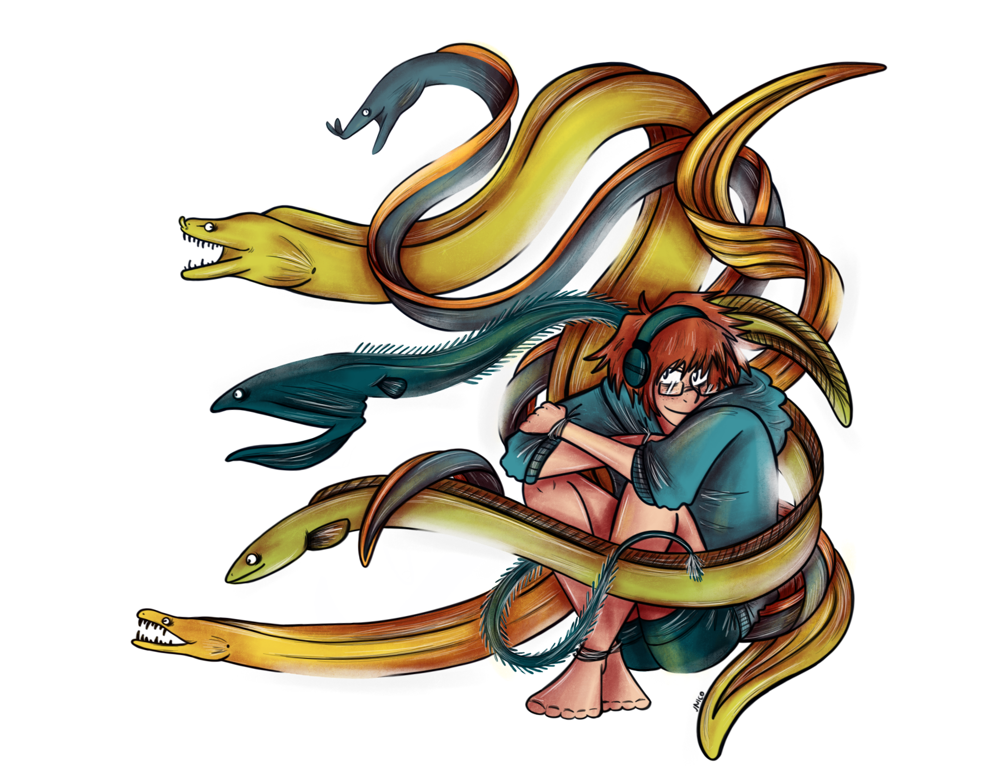

**Hi there, welcome to the "EEL website"!**

You will find here notes, facts and learn about the incredible species that eels are. Each species presented here are illustrated with one of my drawings.

My name is Lise, mostly found as "Baka Unico" on the internet. For a while now, I grow a big interest in eels and their fellow anguilliformes. All about them is so interesting.

Technically, this website is just an excuse for me to gather info about eels and have a place to save all of my notes and my drawings. But, as eels deserve better recognition, why not share it with the world?

Currently a Ph.D. student in ecology, I study the demography and movement of long-lived predatory birds such as birds of prey and sea birds. I'm specialized in mathematical modelling in ecology. I'm passionate about birds, the ocean, the strange creatures living there, paleontology, and nature in general.

Hope you will find this website here interesting!

Want to see a particular species? Please send me a [mail!](unico-falcogriffin@hotmail.fr)

Where to find me \
[TWITTER](https://twitter.com/BakaUnico) \
[INSTAGRAM](https://www.instagram.com/baka_unico/) \
[THUMBLR](https://baka-unico.tumblr.com/)

